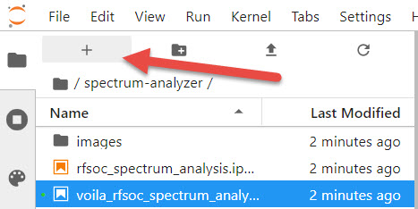
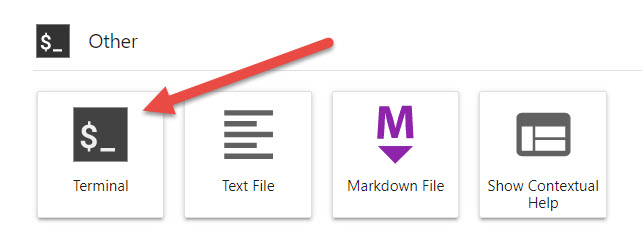

# PYNQ System Generator Projects
This repository hosts PYNQ System Generator projects compatible with [PYNQ image v2.6](https://github.com/Xilinx/PYNQ/releases) for the PYNQ-Z2 and PYNQ-Z1 development board.

## Quick Start
Follow the instructions below to install the System Generator projects on your PYNQ board. **You will need to give your board access to the internet**.
* Power on your PYNQ development board with an SD Card containing a fresh PYNQ v2.6 image.
* Navigate to Jupyter Labs by opening a browser (preferably Chrome) and connect to `http://<board_ip_address>:9090/lab`.
* We need to open a terminal in Jupyter Lab. Firstly, open a launcher window as shown in the figure below:

<p align="center">
  
</p>

* Now open a terminal in Jupyter as illustrated below:

<p align="center">
  
</p>

Run the code below in the jupyter terminal to install the System Generator projects.

```sh
pip3 install git+https://github.com/strath-sdr/pynq_sysgen
```

Now, install the notebooks by running the following command.

```sh
python3 -m pynq_sysgen install
```

Once installation has complete you will find notebooks in the Jupyter workspace directory. The folder will be named 'pynq-system-generator'.

You can also clean the notebooks by running the `clean` command, and uninstall the notebooks by running the `uninstall` command.
 
## Using the Project Files
The following software is required to use the project files in this repository.
- Vivado Design Suite 2020.1
- System Generator for DSP
- MATLAB R2020a

### System Generator
Ensure System Generator has been configured correctly. Now, load System Generator and open a project from the location below:
```sh
/<repository-location>/boards/ip/sysgen/<project-name>/
```

You can simulate and generate the project as required.

### Vivado
This project can be built with Vivado from the command line. Open Vivado 2020.1 and execute the following into the tcl console:
```sh
cd /<repository-location>/boards/<board-name>/<project_name>/
```
Replace the board and project name with the preferred values. Now that we have moved into the correct directory, build the Vivado project by running the make commands below sequentially.
```sh
make block_design
make bitstream
```

Alternatively, you can run the entire project build by executing the following into the tcl console, which will clean the repository after the bitstream has generated:
```sh
make all
```

After build, a bitstream folder will be made available in the project folder.

## License 
[BSD 3-Clause](../../blob/master/LICENSE)
